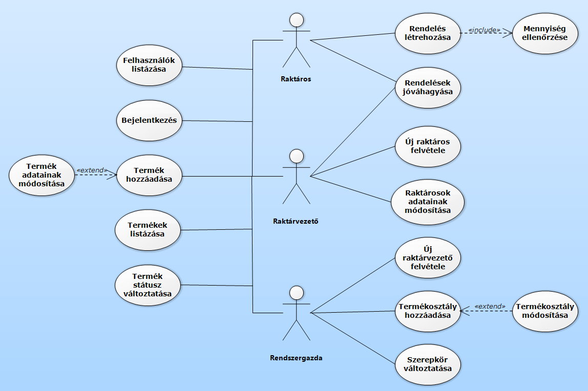
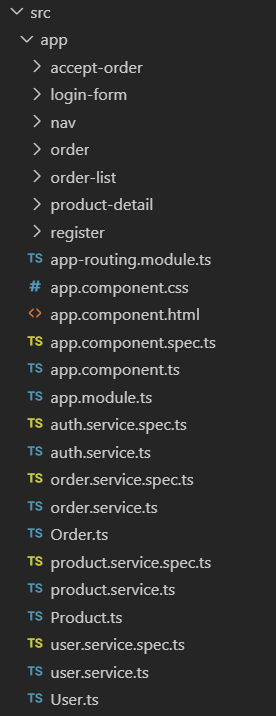

# StorageOperatorFrontend

This project was generated with [Angular CLI](https://github.com/angular/angular-cli) version 8.3.20.

## Development server

Run `ng serve` for a dev server. Navigate to `http://localhost:4200/`. The app will automatically reload if you change any of the source files.

## Use case diagram

## Fejlesztői környezet bemutatása

A fejlesztés során Angular 8.3.20 keretrendszert használtam, a fejlesztői környezet a Visual Studio Code. A program futtatásához szükséges a node_modules mappa bemásolása, majd a projekt mappájában 'ng serve' paranccsal futtathatjuk.

## Alkalmazott könyvtárszerkezet

Az Angular minden komponens hozzáadásánál létrehoz egy mappát az adott komponensnek, ezekben találhatók a hozzá tartozó css, html, illetve ts fájlok. Ezen nem változtattam.

## Kliens oldali szolgáltatások

### AuthService:
A beléptetést végzi, a role based authorization a backenden történik.

### OrderService:
A rendelések hozzáadásáért, illetve kiértékelésért felelős. Minden felhasználónak a hozzá rendelt Orderek jelennek meg.

### ProductService:
A termékek CRUD folyamataiért felelős.

### UserService:
A felhasználók listázásáért felelős.

## Termék hozzáadásának leírása

Terméket csak bejelentkezés után tudunk hozzáadni. A megfelelő adatok (név, ár, mennyiség) beírása után a hozzáadás gombra kattintva a kliens egy post request formájában elküldi a megfelelő adatokat a product/add endpointra, majd ez hozzáadódik a Products táblához. 
